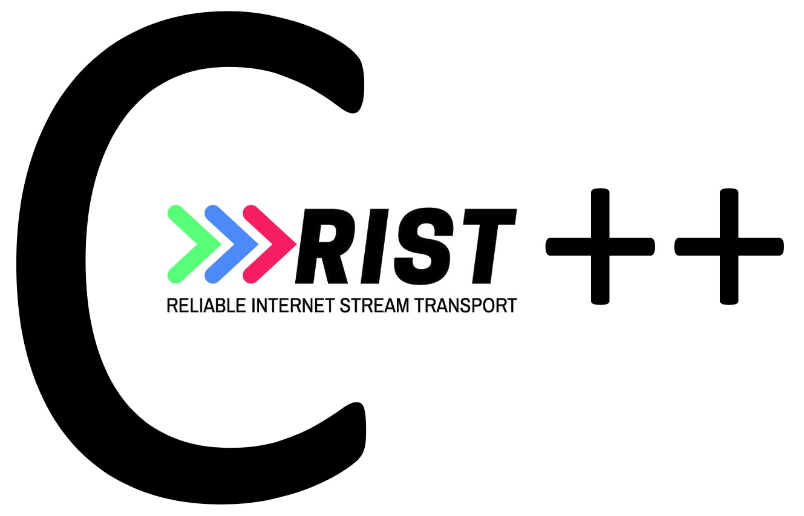

# cppRISTWrapper


The C++ wrapper of [librist](https://code.videolan.org/rist/librist) is creating a thin C++ layer around librist.


## Building


Requires cmake version >= **3.10**, **C++17**, **meson** and **ninja**

The project is currently building on **Linux** and **MacOS**.

**Release:**

```sh
cmake -DCMAKE_BUILD_TYPE=Release .
cmake --build .
```

***Debug:***

```sh
cmake -DCMAKE_BUILD_TYPE=Debug .
cmake --build .
```

Output: 

**libristnet.a**

A static RIST C++ wrapper library 
 
**rist_cpp**

*rist_cpp* (executable) runs trough the unit tests and returns EXIT_SUCESS if all unit tests pass.

## Usage

The rist-cpp > RISTNet class is divided into Receiver/Sender. The Receiver/Sender creation and configuration is detailed below.

**Reciever:**

```cpp
 
//Create the receiver
RISTNetReceiver myRISTNetReceiver;

//Register the callbacks  
//validate the connecting client
myRISTNetReceiver.validateConnectionCallback =
      std::bind(&validateConnection, std::placeholders::_1, std::placeholders::_2);
//receive data from the client
myRISTNetReceiver.networkDataCallback =
      std::bind(&dataFromSender, std::placeholders::_1, std::placeholders::_2, std::placeholders::_3, std::placeholders::_4);

//Generate a vector of RIST URL's,  ip(name), ports, RIST URL output, listen(true) or send mode (false)
std::string lURL;
std::vector<std::string> interfaceListReceiver;
if (myRISTNetTools.buildRISTURL("0.0.0.0", "8000", lURL, true)) {
    interfaceListReceiver.push_back(lURL);
}
if (myRISTNetTools.buildRISTURL("0.0.0.0", "9000", lURL, true)) {
	interfaceListReceiver.push_back(lURL);
}

//Populate the settings
RISTNetReceiver::RISTNetReceiverSettings myReceiveConfiguration;

//Initialize the receiver
if (!myRISTNetReceiver.initReceiver(interfaceListReceiver, myReceiveConfiguration)) {
   std::cout << "Failed starting the server" << std::endl;
   return EXIT_FAILURE;
}

```

**Sender:**

```cpp

//Create a sender.
RISTNetSender myRISTNetSender;

//Generate a vector of RIST URL's,  ip(name), ports, RIST URL output, listen(true) or send mode (false)
std::string lURL;
std::vector<std::tuple<std::string, int>> interfaceListSender;
if (myRISTNetTools.buildRISTURL("127.0.0.1", "8000", lURL, false)) {
    interfaceListSender.push_back(std::tuple<std::string, int>(lURL,5));
}

//Populate the settings
RISTNetSender::RISTNetSenderSettings mySendConfiguration;
myRISTNetSender.initSender(interfaceListSender, mySendConfiguration);

//Send data
myRISTNetSender.sendData((const uint8_t *) mydata.data(), mydata.size());

```

## Using libristnet in your CMake project

* **Step1** 

Add this in your CMake file.

```
#Include libristnet
ExternalProject_Add(project_libristnet
        GIT_REPOSITORY https://code.videolan.org/rist/rist-cpp.git
        SOURCE_DIR ${CMAKE_CURRENT_SOURCE_DIR}/ristwrap
        BINARY_DIR ${CMAKE_CURRENT_SOURCE_DIR}/ristwrap
        GIT_PROGRESS 1
        BUILD_COMMAND cmake --build ${CMAKE_CURRENT_SOURCE_DIR}/ristwrap --config ${CMAKE_BUILD_TYPE} --target ristnet
        STEP_TARGETS build
        EXCLUDE_FROM_ALL TRUE
        INSTALL_COMMAND ""
        )
add_library(ristnet STATIC IMPORTED)
set_property(TARGET ristnet PROPERTY IMPORTED_LOCATION ${CMAKE_CURRENT_SOURCE_DIR}/ristwrap/libristnet.a)
add_dependencies(ristnet project_libristnet)

#Pass information about where to find headers
include_directories(${CMAKE_CURRENT_SOURCE_DIR}/ristwrap/)
include_directories(${CMAKE_CURRENT_SOURCE_DIR}/ristwrap/rist/inc/)
```

* **Step2**

Link your library or executable.

```
target_link_libraries((your target) ristnet ${CMAKE_CURRENT_SOURCE_DIR}/ristwrap/rist/librist.a (the rest you want to link)) 
```

* **Step3** 

Add header file to your project.

```
#include "RISTNet.h"
```

You should now be able to use *libristnet* in your project and use any CMake supported IDE
